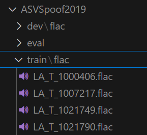

# Deepfake Audio Detection 

## 🔬 1. Research

This repository is part of ongoing research into detecting deepfake audio using machine learning and signal processing techniques.
👉 [View the Research Work](https://your-research-link-here.com)
---

## ⚙️ 2. Implementation of 🎧 SafeEar (on AWS EC2 Ubuntu) 
Follow these steps to set up and run the SafeEar deepfake audio detection model on an AWS EC2 Ubuntu instance.
1. **Update the system and install Python 3.9**
```bash
sudo apt update
sudo apt install git python3.9 python3.9-venv python3.9-dev -y
```
2. **Install pip and upgrade pip==24.0**
```bash
curl https://bootstrap.pypa.io/get-pip.py -o get-pip.py
sudo python3.9 get-pip.py
pip install --upgrade pip==24.0
```
3. **Create and activate virtual environment**
```bash
python3.9 -m venv venv
source venv/bin/activate
```
4. **Install PyTorch with CUDA 11.6 support**
```bash
pip install torch==1.13.1+cu116 torchvision==0.14.1+cu116 torchaudio==0.13.1 --extra-index-url https://download.pytorch.org/whl/cu116
```
5. **Clone the repository**
```bash
git clone https://github.com/JisnaP/DeepfakeAudioDetection.git
cd DeepfakeAudioDetection
```
6. **Install Python dependencies**
```bash
pip install -r requirements.txt
```
7. Please download the [ASVspoof 2019](https://datashare.is.ed.ac.uk/handle/10283/3336) datasets and extract them to the datas/datasets directory
```
datas/
│──datasets/                
│     ├──ASVSpoof2019
│          ├── dev/flac
│          ├── eval/flac    
│          ├── train/fac
```



8. **Generate the Hubert L9 feature files**
```bash
mkdir model_zoos
cd model_zoos
wget https://dl.fbaipublicfiles.com/hubert/hubert_base_ls960.pt
wget https://cloud.tsinghua.edu.cn/f/413a0cd2e6f749eea956/?dl=1 -O SpeechTokenizer.pt
cd ../datas
# Generate the Hubert L9 feature files for ASVspoof 2019
python dump_hubert_avg_feature.py datasets/ASVSpoof2019 datasets/ASVSpoof2019_Hubert_L9
```


9. **Create train.tsv ,dev.tsv and eval.tsv with file names of the audio files with first line the root dir**


10. **📚Training**
Before training please verify the parameter configurations in config
```bash
 python train.py --conf_dir config/train19.yaml  
```
11. **📈Testing/Inference**
```bash
 python test.py --conf_dir 'Exps/ASVspoof19/config.yaml' --ckpt_path 'Exps/ASVspoof19/checkpoints/epoch=0-val_eer=1.0000.ckpt'  
```
'Exps/ASVspoof19/checkpoints/epoch=0-val_eer=1.0000.ckpt' -this is the best model saved. Please extract this from Exps/ASVspoof19/checkpoints folder 

12. **🐞 Bugs and Issues**  
   If you encounter this error:
```
RuntimeError: Failed to load audio from <_io.BytesIO object at 0x7f45cb978f90>
```
Fix by installing an older FFmpeg,4.4: 
```bash
 wget https://ffmpeg.org/releases/ffmpeg-4.3.2.tar.bz2
tar xjvf ffmpeg-4.3.2.tar.bz2
cd ffmpeg-4.3.2
./configure --prefix=$VIRTUAL_ENV --enable-shared
make -j$(nproc)
make install
ffmpeg -version 
```
13. **📈 Performance Metrics**
Performance metrics for ASVSpoof 2019 for 2 epochs 


## 📚 3. Documentation
Explore the architecture, pipeline, and training/evaluation strategy in detail.
**👉 View Full Documentation**